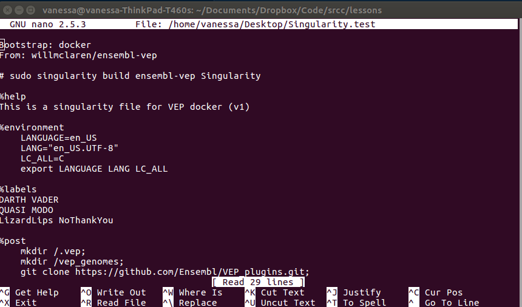
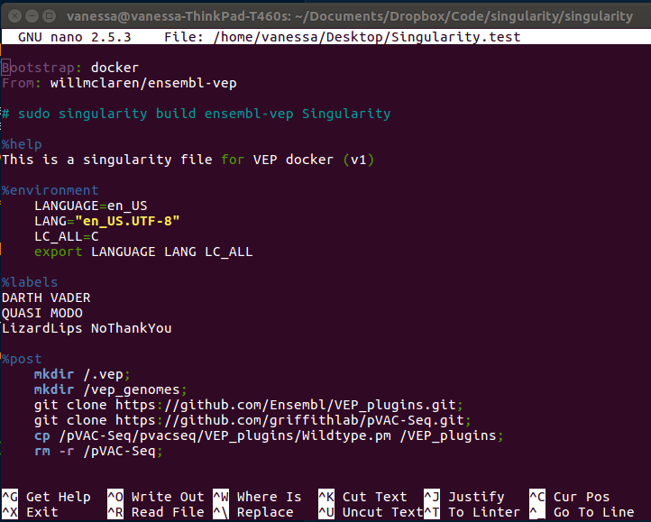

# Nano Syntax Highlighting for Singularity files

**Before**



**After**




## Installation
Here we have two files, one for nano on OSx and the other tested on Ubuntu 16.04.

 - [singularity.osx.nanorc](singularity.osx.nanorc) is for OSx
 - [singularity.debian.nanorc](singularity.debian.nanorc) is for Ubuntu

You can copy the one that works for you to a location where it will be found. 
For example,

```bash
cp singularity.debian.nanorc $HOME/nano/singularity.nanorc
```

Add the following line to your `$HOME/.nanorc` file:

```bash
include /path/to/your/singularity.nanorc
```
