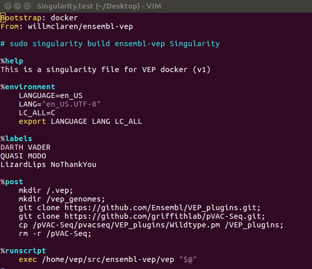

# Vim Syntax Highlighting for Singularity files



## Installation

### Makefile

```bash
git clone https://github.com/singularityware/singularity.lang.git
cd singularity.lang/vim
make install
```

### Vundle

Add the following to your vimrc:

```vim
Plugin 'singularityware/singularity.lang', {'rtp': 'vim/'}
```
